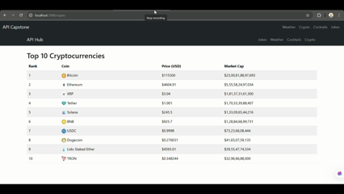

# 🌐 API Capstone Project

A Node.js + Express application using **EJS templates** that integrates multiple public APIs into one project.  
This project demonstrates how to fetch, render, and display live data using REST APIs.

---

## 🚀 Features
- **Weather App** 🌤️ – Get live weather details by entering a city (OpenWeather API).
- **Crypto Dashboard** 💰 – View the top 10 cryptocurrencies by market cap (CoinGecko API).
- **Cocktail Finder** 🍸 – Search for cocktails and get details with images (TheCocktailDB API).
- **Random Jokes** 😂 – Get random jokes instantly (JokeAPI).
- **Simple Navigation** – Easy navigation between different APIs with a clean UI.

---

## 🛠️ Tech Stack
- **Backend:** Node.js, Express.js  
- **Frontend:** EJS templates, Bootstrap  
- **APIs Used:**
  - [OpenWeatherMap](https://openweathermap.org/api)
  - [CoinGecko](https://www.coingecko.com/en/api)
  - [TheCocktailDB](https://www.thecocktaildb.com/api.php)
  - [JokeAPI](https://v2.jokeapi.dev/)

---

## 📂 Project Structure
.
├── app.js # Main server file
├── views/ # EJS templates
│ ├── index.ejs
│ ├── weather.ejs
│ ├── crypto.ejs
│ ├── cocktails.ejs
│ ├── jokes.ejs
│ └── partials/ # Header, Navbar, Footer
├── public/ # Static files (CSS, JS, images)
├── package.json
└── README.md

## ⚙️ Installation & Setup
1. Clone the repository:
   ```bash
   git clone https://github.com/Venkadeshs003/API-Webpage-Project-21.git
   cd <your-repo-name>





